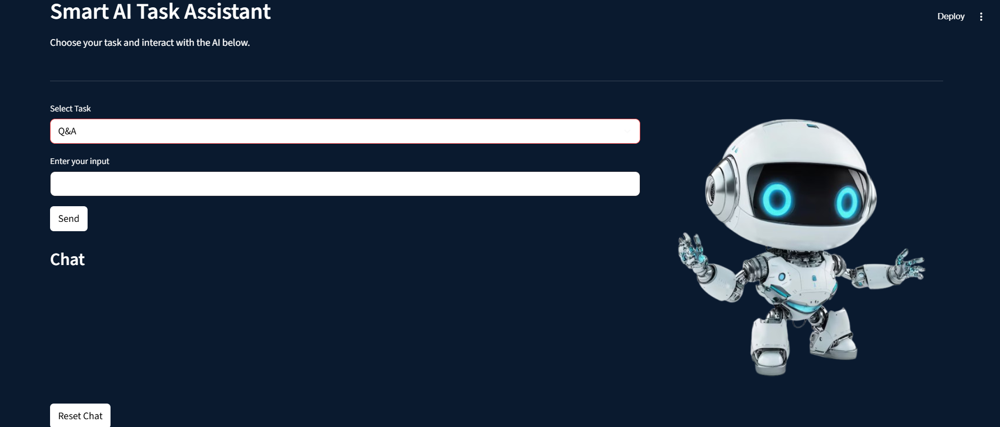
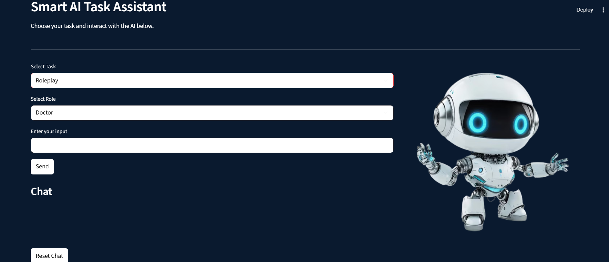
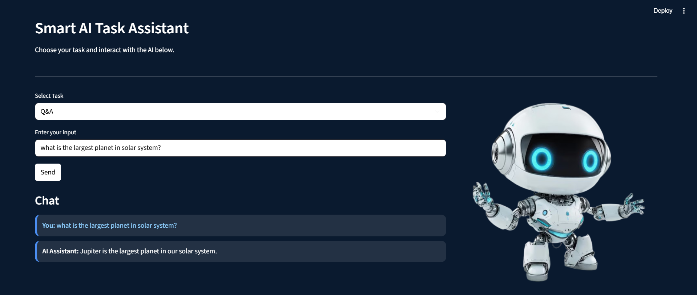

# Smart AI Assistant

This is a unified task-routing AI assistant built using **Streamlit** and powered by the **`phi` model running locally with Ollama**. It supports three intelligent task modes:

- **Q&A**
- **Summarization**
- **Roleplay** (Doctor, Lawyer, Customer Support Agent)

All tasks are routed dynamically with appropriate prompting under the hood. The app features a sleek UI and intelligent input management.

---

## Features

- Clean, minimal interface
- Local LLM integration using [Ollama](https://ollama.com)  
- Task-aware prompt selection (`Q&A`, `Summarization`, `Roleplay`)  
- Role-based dynamic prompts for Roleplay mode
- Chat history display with `"You"` and `"AI Assistant"` names  
- Input box clears automatically after sending

---

## Requirements

- Python 3.8+
- [Ollama](https://ollama.com) (running the `phi` model locally)
- Required Python libraries:
  ```bash
  pip install streamlit requests
  ```

---

## Supported Tasks

### 1. Q&A
Ask concise, factual questions. The model will generate brief answers.

**Prompt Structure:**
```text
Answer the following question concisely.
Question: {user_input}
Answer:
```

### 2. Summarization
Paste an article, paragraph, or notes. The assistant will summarize it in bullet points.

**Prompt Structure:**
```text
Summarize the following article in bullet points.
Article: {user_input}
Summary:
```

### 3. Roleplay
Choose a role and talk to the assistant like you're speaking to:
- **Doctor**
- **Lawyer**
- **Customer Support Agent**

**Prompt Structure Example (Doctor):**
```text
You are an experienced medical doctor specialized in general medicine.
The user asks: '{user_input}'
Doctor:
```

---

## How to Run

1. **Ensure Ollama is installed and running.**

2. **Pull the Phi model:**
   ```bash
   ollama pull phi
   ```

3. **Start your app:**
   ```bash
   streamlit run app.py
   ```

4. **Open in browser:** `http://localhost:8501/`

---

## Preview


<p align=center><i>UI Interface with Q&A option selection</i></p>


<p align=center><i>Option for Role appears upon Roleplay selection</i></p>


<p align=center><i>Demo chat with the AI model</i></p>

---

## Powered by

- **Streamlit**
- **Ollama**
- **phi Language Model**

---

## Project Structure

```bash
Task-Based-AI-Assistant/
├── task_based_ai_assistant.py      # Main Streamlit app
├── images                          # Folder containing preview images
    ├── img1.png
    ├── img2.png
    ├── img3.png
├── README.md                       # README file briefing about the app
├── image1.png                      # AI Bot Image used in UI
```

---

## 📌 Notes

- Make sure `phi` is running locally via Ollama API (`http://localhost:11434`).
- Internet is not required once the model is downloaded.
- Easily extendable to include more tasks or roles.